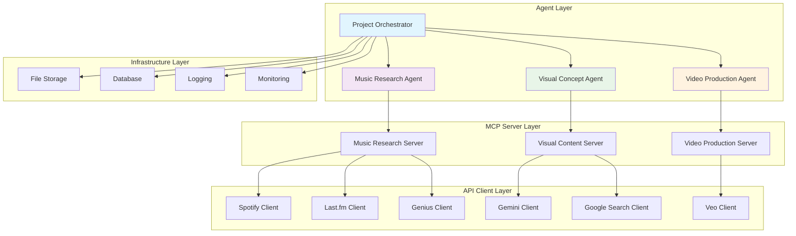

# Empire.AI Multi-Agent Implementation Plan

*Plan Date: 2025-11-14*  
*Status: Draft*  
*Based on: Multi-Agent Coordination Research*

## Overview

This document outlines the detailed implementation plan for Empire.AI's multi-agent music video creation system. The plan follows a phased approach, building from basic agent delegation to advanced workflow coordination.

## Implementation Strategy

### Development Philosophy

1. **Incremental Development**: Build and test each component independently
2. **Type-First Approach**: Define all interfaces with Pydantic models before implementation
3. **Test-Driven Development**: Comprehensive testing at each phase
4. **Production-Ready Code**: Focus on reliability, observability, and maintainability

### Architecture Overview



## Phase 1: Foundation and Basic Delegation

### Duration: 2-3 weeks

### Objectives
- Establish base agent architecture
- Implement core data models
- Create basic agent delegation patterns
- Set up testing framework

### Deliverables

#### 1.1 Core Data Models (`models/`)

**File: `models/project_context.py`**
```python
from pydantic import BaseModel, Field
from typing import Optional, List, Dict, Any
from datetime import datetime
from enum import Enum

class WorkflowStatus(str, Enum):
    INITIALIZED = "initialized"
    RESEARCH_IN_PROGRESS = "research_in_progress"
    CONCEPT_DEVELOPMENT = "concept_development"
    VIDEO_PRODUCTION = "video_production"
    QUALITY_REVIEW = "quality_review"
    COMPLETED = "completed"
    FAILED = "failed"

class ProjectContext(BaseModel):
    """Central project state shared across all agents."""
    project_id: str = Field(description="Unique project identifier")
    artist_name: str = Field(description="Target artist name")
    song_title: str = Field(description="Target song title")
    workflow_status: WorkflowStatus = Field(default=WorkflowStatus.INITIALIZED)
    created_at: datetime = Field(default_factory=datetime.now)
    updated_at: datetime = Field(default_factory=datetime.now)
    
    # Agent-specific data
    artist_profile: Optional['ArtistProfile'] = None
    song_analysis: Optional['SongAnalysis'] = None
    visual_concepts: List['VisualConcept'] = Field(default_factory=list)
    video_segments: List['VideoSegment'] = Field(default_factory=list)
    
    # Metadata
    user_preferences: Dict[str, Any] = Field(default_factory=dict)
    quality_requirements: Dict[str, Any] = Field(default_factory=dict)
    progress_tracking: Dict[str, Any] = Field(default_factory=dict)
```

**File: `models/agent_communication.py`**
```python
class AgentResult(BaseModel):
    """Standardized agent response format."""
    success: bool = Field(description="Whether operation succeeded")
    agent_name: str = Field(description="Name of responding agent")
    operation: str = Field(description="Operation performed")
    data: Optional[Any] = Field(description="Result data")
    error: Optional[str] = Field(description="Error message if failed")
    metadata: Dict[str, Any] = Field(default_factory=dict)
    next_steps: Optional[List[str]] = Field(description="Suggested next actions")
    execution_time: float = Field(description="Operation duration in seconds")

class Failed(BaseModel):
    """Standardized failure response."""
    reason: str = Field(description="Failure reason")
    error_code: str = Field(description="Machine-readable error code")
    agent_name: str = Field(description="Agent that failed")
    operation: str = Field(description="Failed operation")
    recovery_suggestions: List[str] = Field(default_factory=list)
    context: Dict[str, Any] = Field(default_factory=dict)

class AgentMessage(BaseModel):
    """Inter-agent communication message."""
    message_id: str = Field(description="Unique message identifier")
    from_agent: str = Field(description="Sender agent name")
    to_agent: str = Field(description="Recipient agent name")
    message_type: str = Field(description="Message type")
    payload: Dict[str, Any] = Field(description="Message data")
    timestamp: datetime = Field(default_factory=datetime.now)
    correlation_id: Optional[str] = Field(description="Request correlation ID")
```

#### 1.2 Base Agent Architecture (`agents/`)

**File: `agents/base_agent.py`**
```python
from abc import ABC, abstractmethod
from typing import Optional, Dict, Any, Type, Union
from pydantic_ai import Agent, RunContext, RunUsage
from mcp import ClientSession
import logging
import time
import uuid

from models.project_context import ProjectContext
from models.agent_communication import AgentResult, Failed

class BaseEmpireAgent(ABC):
    """Base class for all Empire.AI agents."""
    
    def __init__(
        self,
        agent_name: str,
        mcp_session: ClientSession,
        model: str = "anthropic:claude-3.5-sonnet",
        logger: Optional[logging.Logger] = None
    ):
        self.agent_name = agent_name
        self.mcp_session = mcp_session
        self.model = model
        self.logger = logger or logging.getLogger(f"empire.agents.{agent_name}")
        self.usage = RunUsage()
        
        # Initialize Pydantic AI agent
        self.agent = self._init_agent()
        
        # Performance tracking
        self.operation_metrics: Dict[str, Any] = {}
    
    @abstractmethod
    def _init_agent(self) -> Agent:
        """Initialize the Pydantic AI agent with tools and configuration."""
        pass
    
    @abstractmethod
    def get_system_prompt(self) -> str:
        """Get agent-specific system prompt."""
        pass
    
    @abstractmethod
    def get_output_type(self) -> Type:
        """Get agent-specific output type."""
        pass
    
    async def run(
        self,
        query: str,
        context: Optional[ProjectContext] = None,
        correlation_id: Optional[str] = None
    ) -> Union[AgentResult, Failed]:
        """Execute agent operation with standardized error handling."""
        
        start_time = time.time()
        operation_id = correlation_id or str(uuid.uuid4())
        
        self.logger.info(
            f"Starting operation: {query[:100]}...",
            extra={"operation_id": operation_id, "agent": self.agent_name}
        )
        
        try:
            # Run the Pydantic AI agent
            result = await self.agent.run(
                query,
                deps=context,
                usage=self.usage
            )
            
            execution_time = time.time() - start_time
            
            # Log successful operation
            self.logger.info(
                f"Operation completed successfully in {execution_time:.2f}s",
                extra={"operation_id": operation_id, "execution_time": execution_time}
            )
            
            return AgentResult(
                success=True,
                agent_name=self.agent_name,
                operation=query[:100],
                data=result.output,
                metadata={
                    "usage": self.usage.model_dump(),
                    "operation_id": operation_id
                },
                execution_time=execution_time
            )
            
        except Exception as e:
            execution_time = time.time() - start_time
            error_msg = str(e)
            
            # Log error with context
            self.logger.error(
                f"Operation failed: {error_msg}",
                extra={
                    "operation_id": operation_id,
                    "error": error_msg,
                    "execution_time": execution_time
                },
                exc_info=True
            )
            
            return Failed(
                reason=error_msg,
                error_code=type(e).__name__,
                agent_name=self.agent_name,
                operation=query[:100],
                recovery_suggestions=self._get_recovery_suggestions(e),
                context={
                    "operation_id": operation_id,
                    "execution_time": execution_time
                }
            )
    
    def _get_recovery_suggestions(self, error: Exception) -> List[str]:
        """Generate context-specific recovery suggestions."""
        suggestions = []
        
        if "timeout" in str(error).lower():
            suggestions.append("Retry with shorter timeout")
            suggestions.append("Check network connectivity")
        
        if "rate limit" in str(error).lower():
            suggestions.append("Wait before retrying")
            suggestions.append("Use alternative API endpoint")
        
        if "authentication" in str(error).lower():
            suggestions.append("Verify API credentials")
            suggestions.append("Check token expiration")
        
        return suggestions or ["Review error details and retry"]
    
    async def health_check(self) -> Dict[str, Any]:
        """Perform agent health check."""
        try:
            # Test MCP connection
            await self.mcp_session.list_tools()
            
            return {
                "status": "healthy",
                "agent": self.agent_name,
                "mcp_connected": True,
                "model": self.model,
                "usage_stats": self.usage.model_dump()
            }
        except Exception as e:
            return {
                "status": "unhealthy",
                "agent": self.agent_name,
                "error": str(e),
                "mcp_connected": False
            }
```

#### 1.3 Music Research Agent (`agents/music_research_agent.py`)

```python
from typing import Union
from pydantic_ai import Agent, RunContext
from pydantic import BaseModel, Field

from agents.base_agent import BaseEmpireAgent
from models.project_context import ProjectContext
from models.music_data import ArtistProfile, SongAnalysis
from models.agent_communication import Failed

class MusicResearchResult(BaseModel):
    """Music research operation result."""
    artist_profile: Optional[ArtistProfile] = None
    song_analysis: Optional[SongAnalysis] = None
    research_summary: str = Field(description="Summary of research findings")
    confidence_score: float = Field(description="Confidence in research quality", ge=0.0, le=1.0)
    recommendations: List[str] = Field(description="Recommendations for visual/video creation")

class MusicResearchAgent(BaseEmpireAgent):
    """Agent specialized in music research and analysis."""
    
    def __init__(self, mcp_session, **kwargs):
        super().__init__("music_research", mcp_session, **kwargs)
    
    def _init_agent(self) -> Agent:
        agent = Agent(
            model=self.model,
            output_type=self.get_output_type(),
            deps_type=ProjectContext,
            system_prompt=self.get_system_prompt()
        )
        
        @agent.tool
        async def research_artist(ctx: RunContext[ProjectContext], artist_name: str) -> str:
            """Research artist using music research MCP server."""
            try:
                result = await self.mcp_session.call_tool(
                    "music_get_artist_profile",
                    {
                        "artist_name": artist_name,
                        "include_audio_analysis": True,
                        "include_biography": True,
                        "include_similar_artists": True
                    }
                )
                return str(result)
            except Exception as e:
                self.logger.error(f"Artist research failed: {e}")
                return f"Artist research failed: {e}"
        
        @agent.tool
        async def analyze_song(ctx: RunContext[ProjectContext], song_title: str, artist_name: str) -> str:
            """Analyze song using music research MCP server."""
            try:
                result = await self.mcp_session.call_tool(
                    "music_analyze_song",
                    {
                        "song_title": song_title,
                        "artist_name": artist_name,
                        "include_lyrics": True,
                        "include_annotations": True,
                        "include_audio_features": True
                    }
                )
                return str(result)
            except Exception as e:
                self.logger.error(f"Song analysis failed: {e}")
                return f"Song analysis failed: {e}"
        
        @agent.tool
        async def discover_similar_artists(ctx: RunContext[ProjectContext], artist_name: str) -> str:
            """Discover similar artists for inspiration."""
            try:
                result = await self.mcp_session.call_tool(
                    "music_discover_similar_artists",
                    {
                        "artist_name": artist_name,
                        "limit": 10,
                        "include_audio_analysis": True
                    }
                )
                return str(result)
            except Exception as e:
                self.logger.error(f"Similar artist discovery failed: {e}")
                return f"Similar artist discovery failed: {e}"
        
        return agent
    
    def get_system_prompt(self) -> str:
        return """
        You are a music research specialist for Empire.AI's music video creation system.
        
        Your primary responsibilities:
        1. Research artists comprehensively using available tools
        2. Analyze songs for lyrical content, themes, and musical characteristics
        3. Identify musical patterns and audio features that inform visual creation
        4. Provide cultural and historical context
        5. Suggest related artists and influences for creative inspiration
        
        Guidelines:
        - Always use available tools to gather comprehensive data
        - Focus on elements that can inspire visual concepts and video aesthetics
        - Provide confidence scores for your analysis
        - Include specific recommendations for visual/video teams
        - Consider cultural sensitivity and artistic authenticity
        
        Output Format:
        - Structured data with artist profiles and song analysis
        - Clear research summary with key findings
        - Actionable recommendations for creative teams
        - Confidence assessment of research quality
        """
    
    def get_output_type(self):
        return Union[MusicResearchResult, Failed]
```

### Phase 1 Testing Strategy

#### 1.4 Unit Tests (`tests/`)

**File: `tests/test_base_agent.py`**
```python
import pytest
import asyncio
from unittest.mock import Mock, AsyncMock

from agents.base_agent import BaseEmpireAgent
from models.project_context import ProjectContext
from models.agent_communication import AgentResult, Failed

class TestAgent(BaseEmpireAgent):
    """Test implementation of BaseEmpireAgent."""
    
    def _init_agent(self):
        return Mock()
    
    def get_system_prompt(self):
        return "Test prompt"
    
    def get_output_type(self):
        return str

@pytest.fixture
def mock_mcp_session():
    session = AsyncMock()
    session.call_tool.return_value = {"result": "test"}
    return session

@pytest.fixture
def test_agent(mock_mcp_session):
    return TestAgent("test_agent", mock_mcp_session)

@pytest.mark.asyncio
async def test_agent_initialization(test_agent):
    assert test_agent.agent_name == "test_agent"
    assert test_agent.model == "anthropic:claude-3.5-sonnet"
    assert test_agent.usage is not None

@pytest.mark.asyncio
async def test_health_check_success(test_agent):
    health = await test_agent.health_check()
    assert health["status"] == "healthy"
    assert health["agent"] == "test_agent"
    assert health["mcp_connected"] == True

@pytest.mark.asyncio
async def test_health_check_failure(test_agent):
    test_agent.mcp_session.list_tools.side_effect = Exception("Connection failed")
    health = await test_agent.health_check()
    assert health["status"] == "unhealthy"
    assert health["mcp_connected"] == False
```

#### 1.5 Integration Tests

**File: `tests/test_music_research_integration.py`**
```python
import pytest
from agents.music_research_agent import MusicResearchAgent
from models.project_context import ProjectContext, WorkflowStatus

@pytest.mark.asyncio
async def test_music_research_workflow():
    # Mock MCP session with realistic responses
    mock_session = AsyncMock()
    mock_session.call_tool.return_value = {
        "artist_name": "Test Artist",
        "genres": ["rock", "alternative"],
        "audio_features": {"energy": 0.8, "valence": 0.6}
    }
    
    agent = MusicResearchAgent(mock_session)
    
    context = ProjectContext(
        project_id="test-123",
        artist_name="Test Artist",
        song_title="Test Song",
        workflow_status=WorkflowStatus.RESEARCH_IN_PROGRESS
    )
    
    result = await agent.run(
        "Research Test Artist and analyze Test Song",
        context=context
    )
    
    assert isinstance(result, AgentResult)
    assert result.success == True
    assert result.agent_name == "music_research"
    assert result.data is not None
```

## Phase 2: Enhanced Coordination

### Duration: 3-4 weeks

### Objectives
- Implement all four specialized agents
- Create project orchestrator with workflow management
- Add parallel execution capabilities
- Implement state persistence

### Deliverables

#### 2.1 Complete Agent Suite

- **Visual Concept Agent** (`agents/visual_concept_agent.py`)
- **Video Production Agent** (`agents/video_production_agent.py`)
- **Project Orchestrator Agent** (`agents/project_orchestrator.py`)

#### 2.2 Workflow Management

**File: `workflow/workflow_manager.py`**
```python
from enum import Enum
from typing import Dict, List, Optional, Callable, Any
from dataclasses import dataclass
import asyncio
from datetime import datetime

class WorkflowPattern(str, Enum):
    SEQUENTIAL = "sequential"
    PARALLEL = "parallel"
    ITERATIVE = "iterative"
    CUSTOM = "custom"

@dataclass
class WorkflowStep:
    step_id: str
    agent_name: str
    operation: str
    dependencies: List[str]
    timeout: int = 300
    retry_count: int = 3
    required: bool = True

class WorkflowManager:
    """Manages complex multi-agent workflows."""
    
    def __init__(self, agents: Dict[str, BaseEmpireAgent]):
        self.agents = agents
        self.active_workflows: Dict[str, WorkflowExecution] = {}
    
    async def execute_workflow(
        self,
        workflow_id: str,
        pattern: WorkflowPattern,
        context: ProjectContext,
        custom_steps: Optional[List[WorkflowStep]] = None
    ) -> WorkflowResult:
        """Execute a workflow with specified pattern."""
        
        if pattern == WorkflowPattern.SEQUENTIAL:
            return await self._execute_sequential(workflow_id, context)
        elif pattern == WorkflowPattern.PARALLEL:
            return await self._execute_parallel(workflow_id, context)
        elif pattern == WorkflowPattern.ITERATIVE:
            return await self._execute_iterative(workflow_id, context)
        elif pattern == WorkflowPattern.CUSTOM:
            return await self._execute_custom(workflow_id, context, custom_steps)
    
    async def _execute_sequential(self, workflow_id: str, context: ProjectContext):
        """Execute agents in sequence: Music -> Visual -> Video."""
        results = {}
        
        # Phase 1: Music Research
        music_result = await self.agents["music_research"].run(
            f"Research {context.artist_name} and analyze {context.song_title}",
            context=context
        )
        results["music_research"] = music_result
        
        if not music_result.success:
            return WorkflowResult(success=False, results=results)
        
        # Update context with music data
        context.artist_profile = music_result.data.artist_profile
        context.song_analysis = music_result.data.song_analysis
        
        # Phase 2: Visual Concept Development
        visual_result = await self.agents["visual_concept"].run(
            f"Create visual concepts for {context.song_title} by {context.artist_name}",
            context=context
        )
        results["visual_concept"] = visual_result
        
        if not visual_result.success:
            return WorkflowResult(success=False, results=results)
        
        # Update context with visual data
        context.visual_concepts = visual_result.data.concepts
        
        # Phase 3: Video Production
        video_result = await self.agents["video_production"].run(
            f"Produce music video for {context.song_title}",
            context=context
        )
        results["video_production"] = video_result
        
        return WorkflowResult(
            success=video_result.success,
            results=results,
            final_output=video_result.data if video_result.success else None
        )
```

#### 2.3 State Persistence

**File: `persistence/project_state.py`**
```python
from typing import Optional, Dict, Any
import json
import aiofiles
from pathlib import Path
import asyncio
from datetime import datetime

from models.project_context import ProjectContext

class ProjectStatePersistence:
    """Handles project state persistence and recovery."""
    
    def __init__(self, storage_path: Path):
        self.storage_path = storage_path
        self.storage_path.mkdir(parents=True, exist_ok=True)
        self._locks: Dict[str, asyncio.Lock] = {}
    
    def _get_lock(self, project_id: str) -> asyncio.Lock:
        """Get or create a lock for project state operations."""
        if project_id not in self._locks:
            self._locks[project_id] = asyncio.Lock()
        return self._locks[project_id]
    
    def _get_project_file(self, project_id: str) -> Path:
        """Get the file path for a project's state."""
        return self.storage_path / f"{project_id}.json"
    
    async def save_context(self, context: ProjectContext) -> bool:
        """Save project context to persistent storage."""
        lock = self._get_lock(context.project_id)
        
        async with lock:
            try:
                file_path = self._get_project_file(context.project_id)
                context.updated_at = datetime.now()
                
                # Serialize context to JSON
                context_data = context.model_dump(mode='json')
                
                async with aiofiles.open(file_path, 'w') as f:
                    await f.write(json.dumps(context_data, indent=2))
                
                return True
            except Exception as e:
                logging.error(f"Failed to save context for {context.project_id}: {e}")
                return False
    
    async def load_context(self, project_id: str) -> Optional[ProjectContext]:
        """Load project context from persistent storage."""
        lock = self._get_lock(project_id)
        
        async with lock:
            try:
                file_path = self._get_project_file(project_id)
                
                if not file_path.exists():
                    return None
                
                async with aiofiles.open(file_path, 'r') as f:
                    content = await f.read()
                
                context_data = json.loads(content)
                return ProjectContext.model_validate(context_data)
                
            except Exception as e:
                logging.error(f"Failed to load context for {project_id}: {e}")
                return None
    
    async def update_partial(
        self,
        project_id: str,
        updates: Dict[str, Any]
    ) -> bool:
        """Perform partial update of project context."""
        lock = self._get_lock(project_id)
        
        async with lock:
            # Load existing context
            context = await self.load_context(project_id)
            if not context:
                return False
            
            # Apply updates
            for key, value in updates.items():
                if hasattr(context, key):
                    setattr(context, key, value)
            
            # Save updated context
            return await self.save_context(context)
    
    async def delete_context(self, project_id: str) -> bool:
        """Delete project context from storage."""
        try:
            file_path = self._get_project_file(project_id)
            if file_path.exists():
                file_path.unlink()
            return True
        except Exception as e:
            logging.error(f"Failed to delete context for {project_id}: {e}")
            return False
```

## Phase 3: Advanced Features

### Duration: 4-5 weeks

### Objectives
- Implement graph-based workflow support
- Add human-in-the-loop capabilities
- Create advanced quality control
- Build monitoring and observability

### Deliverables

#### 3.1 Graph-Based Workflows

**File: `workflow/graph_workflow.py`**
```python
from pydantic_graph import Graph, BaseNode, End
from dataclasses import dataclass
from typing import Union, Optional

@dataclass
class MusicResearchNode(BaseNode[ProjectContext, EmpireAgentDeps, None]):
    artist_name: str
    song_title: str
    
    async def run(self, ctx) -> Union['VisualConceptNode', End[str]]:
        agent = ctx.deps.agents["music_research"]
        result = await agent.run(
            f"Research {self.artist_name} and analyze {self.song_title}",
            context=ctx.state
        )
        
        if result.success:
            # Update context and proceed
            ctx.state.artist_profile = result.data.artist_profile
            ctx.state.song_analysis = result.data.song_analysis
            return VisualConceptNode(
                artist_name=self.artist_name,
                song_title=self.song_title
            )
        else:
            return End(f"Music research failed: {result.error}")

@dataclass
class VisualConceptNode(BaseNode[ProjectContext, EmpireAgentDeps, None]):
    artist_name: str
    song_title: str
    
    async def run(self, ctx) -> Union['QualityReviewNode', 'VideoProductionNode']:
        agent = ctx.deps.agents["visual_concept"]
        result = await agent.run(
            f"Create visual concepts for {self.song_title} by {self.artist_name}",
            context=ctx.state
        )
        
        if result.success:
            ctx.state.visual_concepts = result.data.concepts
            
            # Decide next step based on quality requirements
            if ctx.state.quality_requirements.get("require_review", False):
                return QualityReviewNode()
            else:
                return VideoProductionNode()
        else:
            return End(f"Visual concept creation failed: {result.error}")

class EmpireWorkflowGraph(Graph[ProjectContext, EmpireAgentDeps]):
    """Graph-based workflow for Empire.AI."""
    
    def __init__(self, agents: Dict[str, BaseEmpireAgent]):
        self.agents = agents
        super().__init__()
    
    async def run_workflow(
        self,
        project_context: ProjectContext,
        start_node: BaseNode
    ) -> Any:
        """Execute the workflow graph."""
        deps = EmpireAgentDeps(
            project_context=project_context,
            agents=self.agents
        )
        
        return await self.run(
            start_node,
            state=project_context,
            deps=deps
        )
```

#### 3.2 Human-in-the-Loop Integration

**File: `human_loop/interaction_manager.py`**
```python
from typing import Optional, Dict, Any, List
from enum import Enum
from pydantic import BaseModel
import asyncio
from datetime import datetime, timedelta

class InteractionType(str, Enum):
    APPROVAL_REQUEST = "approval_request"
    FEEDBACK_REQUEST = "feedback_request"
    CHOICE_REQUEST = "choice_request"
    QUALITY_REVIEW = "quality_review"

class HumanInteractionRequest(BaseModel):
    request_id: str
    interaction_type: InteractionType
    title: str
    description: str
    data: Dict[str, Any]
    choices: Optional[List[str]] = None
    timeout_seconds: int = 300
    created_at: datetime = Field(default_factory=datetime.now)

class HumanInteractionResponse(BaseModel):
    request_id: str
    approved: bool
    feedback: Optional[str] = None
    choice: Optional[str] = None
    additional_data: Dict[str, Any] = Field(default_factory=dict)
    responded_at: datetime = Field(default_factory=datetime.now)

class HumanInteractionManager:
    """Manages human-in-the-loop interactions."""
    
    def __init__(self):
        self.pending_requests: Dict[str, HumanInteractionRequest] = {}
        self.responses: Dict[str, HumanInteractionResponse] = {}
        self.response_events: Dict[str, asyncio.Event] = {}
    
    async def request_human_input(
        self,
        interaction_type: InteractionType,
        title: str,
        description: str,
        data: Dict[str, Any],
        choices: Optional[List[str]] = None,
        timeout_seconds: int = 300
    ) -> Optional[HumanInteractionResponse]:
        """Request input from human operator."""
        
        request_id = str(uuid.uuid4())
        request = HumanInteractionRequest(
            request_id=request_id,
            interaction_type=interaction_type,
            title=title,
            description=description,
            data=data,
            choices=choices,
            timeout_seconds=timeout_seconds
        )
        
        # Store request and create response event
        self.pending_requests[request_id] = request
        self.response_events[request_id] = asyncio.Event()
        
        # Notify UI/interface about new request
        await self._notify_interface(request)
        
        # Wait for response with timeout
        try:
            await asyncio.wait_for(
                self.response_events[request_id].wait(),
                timeout=timeout_seconds
            )
            
            # Return response if received
            return self.responses.get(request_id)
            
        except asyncio.TimeoutError:
            # Clean up on timeout
            self._cleanup_request(request_id)
            return None
    
    async def provide_response(
        self,
        request_id: str,
        approved: bool,
        feedback: Optional[str] = None,
        choice: Optional[str] = None,
        additional_data: Optional[Dict[str, Any]] = None
    ) -> bool:
        """Provide response to pending request."""
        
        if request_id not in self.pending_requests:
            return False
        
        response = HumanInteractionResponse(
            request_id=request_id,
            approved=approved,
            feedback=feedback,
            choice=choice,
            additional_data=additional_data or {}
        )
        
        # Store response and signal completion
        self.responses[request_id] = response
        self.response_events[request_id].set()
        
        return True
    
    async def _notify_interface(self, request: HumanInteractionRequest):
        """Notify user interface about new interaction request."""
        # Implementation depends on UI framework
        # Could be WebSocket, REST API, CLI prompt, etc.
        pass
    
    def _cleanup_request(self, request_id: str):
        """Clean up request data after completion or timeout."""
        self.pending_requests.pop(request_id, None)
        self.responses.pop(request_id, None)
        self.response_events.pop(request_id, None)
```

#### 3.3 Quality Control System

**File: `quality/quality_controller.py`**
```python
from typing import List, Dict, Any, Optional
from enum import Enum
from pydantic import BaseModel, Field
from datetime import datetime

class QualityMetric(str, Enum):
    CONTENT_ACCURACY = "content_accuracy"
    VISUAL_QUALITY = "visual_quality"
    AUDIO_SYNC = "audio_sync"
    BRAND_SAFETY = "brand_safety"
    TECHNICAL_QUALITY = "technical_quality"
    CREATIVE_ALIGNMENT = "creative_alignment"

class QualityScore(BaseModel):
    metric: QualityMetric
    score: float = Field(ge=0.0, le=1.0)
    confidence: float = Field(ge=0.0, le=1.0)
    details: str
    suggestions: List[str] = Field(default_factory=list)

class QualityAssessment(BaseModel):
    assessment_id: str
    content_type: str  # "music_research", "visual_concept", "video_segment"
    content_id: str
    scores: List[QualityScore]
    overall_score: float = Field(ge=0.0, le=1.0)
    passed: bool
    issues: List[str] = Field(default_factory=list)
    recommendations: List[str] = Field(default_factory=list)
    assessed_at: datetime = Field(default_factory=datetime.now)

class QualityController:
    """Automated quality control for Empire.AI outputs."""
    
    def __init__(self, quality_thresholds: Dict[QualityMetric, float]):
        self.thresholds = quality_thresholds
        self.assessment_history: List[QualityAssessment] = []
    
    async def assess_music_research(
        self,
        research_result: Any,
        context: ProjectContext
    ) -> QualityAssessment:
        """Assess quality of music research results."""
        
        scores = []
        
        # Content accuracy assessment
        accuracy_score = await self._assess_content_accuracy(
            research_result, context
        )
        scores.append(accuracy_score)
        
        # Data completeness assessment
        completeness_score = await self._assess_data_completeness(
            research_result
        )
        scores.append(completeness_score)
        
        # Calculate overall assessment
        overall_score = sum(s.score * s.confidence for s in scores) / len(scores)
        passed = overall_score >= self.thresholds.get(
            QualityMetric.CONTENT_ACCURACY, 0.7
        )
        
        assessment = QualityAssessment(
            assessment_id=str(uuid.uuid4()),
            content_type="music_research",
            content_id=context.project_id,
            scores=scores,
            overall_score=overall_score,
            passed=passed,
            issues=self._extract_issues(scores),
            recommendations=self._generate_recommendations(scores)
        )
        
        self.assessment_history.append(assessment)
        return assessment
    
    async def _assess_content_accuracy(
        self,
        research_result: Any,
        context: ProjectContext
    ) -> QualityScore:
        """Assess accuracy of research content."""
        
        # Check if artist name matches
        artist_match = (
            research_result.artist_profile and
            research_result.artist_profile.name.lower() == 
            context.artist_name.lower()
        )
        
        # Check if song data is present
        song_data_present = (
            research_result.song_analysis and
            research_result.song_analysis.title.lower() == 
            context.song_title.lower()
        )
        
        # Calculate accuracy score
        accuracy = 0.0
        if artist_match:
            accuracy += 0.5
        if song_data_present:
            accuracy += 0.5
        
        return QualityScore(
            metric=QualityMetric.CONTENT_ACCURACY,
            score=accuracy,
            confidence=0.9,
            details=f"Artist match: {artist_match}, Song data: {song_data_present}",
            suggestions=[
                "Verify artist name spelling",
                "Check song title accuracy"
            ] if accuracy < 1.0 else []
        )
```

## Implementation Timeline

### Week-by-Week Breakdown

#### Weeks 1-2: Foundation
- [ ] Set up project structure and dependencies
- [ ] Implement core data models
- [ ] Create base agent architecture
- [ ] Build music research agent
- [ ] Write comprehensive tests

#### Weeks 3-4: Basic Coordination
- [ ] Implement visual concept agent
- [ ] Create video production agent
- [ ] Build basic project orchestrator
- [ ] Add sequential workflow support
- [ ] Integration testing

#### Weeks 5-6: Enhanced Features
- [ ] Implement parallel execution
- [ ] Add state persistence
- [ ] Create workflow manager
- [ ] Build error recovery mechanisms
- [ ] Performance optimization

#### Weeks 7-8: Advanced Coordination
- [ ] Implement iterative refinement workflows
- [ ] Add quality control systems
- [ ] Create monitoring and logging
- [ ] Build human-in-the-loop support
- [ ] End-to-end testing

#### Weeks 9-10: Graph Workflows
- [ ] Implement graph-based workflow engine
- [ ] Create complex workflow patterns
- [ ] Add workflow visualization
- [ ] Advanced error handling
- [ ] Performance tuning

#### Weeks 11-12: Production Ready
- [ ] Comprehensive testing suite
- [ ] Documentation and examples
- [ ] Deployment configuration
- [ ] Monitoring and alerting
- [ ] User acceptance testing

## Success Criteria

### Technical Metrics

- [ ] **Type Safety**: 100% type coverage with mypy
- [ ] **Test Coverage**: >90% code coverage
- [ ] **Performance**: <30s average workflow completion
- [ ] **Reliability**: <5% error rate in production
- [ ] **Scalability**: Support for 10+ concurrent workflows

### Quality Metrics

- [ ] **Agent Coordination**: Successful cross-agent data flow
- [ ] **Workflow Flexibility**: Support for all three workflow patterns
- [ ] **Error Recovery**: Graceful handling of agent failures
- [ ] **State Management**: Reliable persistence and recovery
- [ ] **Human Integration**: Seamless human-in-the-loop workflows

### Business Metrics

- [ ] **User Experience**: <2 minutes to start workflow
- [ ] **Output Quality**: >90% user satisfaction
- [ ] **System Reliability**: >99% uptime
- [ ] **Development Velocity**: <1 week for new agent integration
- [ ] **Maintenance Cost**: <20% of development effort

## Risk Mitigation

### Technical Risks

1. **Agent Coordination Complexity**
   - **Mitigation**: Start with simple patterns, iterate
   - **Fallback**: Manual workflow orchestration

2. **Performance Bottlenecks**
   - **Mitigation**: Profiling and optimization at each phase
   - **Fallback**: Simplified workflows with reduced features

3. **State Synchronization Issues**
   - **Mitigation**: Atomic operations and transaction-like patterns
   - **Fallback**: Stateless operation with external state management

### Operational Risks

1. **Agent Failure Cascades**
   - **Mitigation**: Circuit breaker patterns and fallback agents
   - **Monitoring**: Real-time agent health checks

2. **Resource Exhaustion**
   - **Mitigation**: Resource limits and queue management
   - **Monitoring**: Resource usage tracking and alerting

3. **Quality Degradation**
   - **Mitigation**: Automated quality checks and human oversight
   - **Monitoring**: Quality metrics tracking and trending

## Next Steps

1. **Project Setup**
   - Initialize repository structure
   - Set up development environment
   - Configure CI/CD pipeline

2. **Team Coordination**
   - Assign implementation responsibilities
   - Establish code review process
   - Set up regular progress reviews

3. **Stakeholder Communication**
   - Regular demo sessions
   - Progress reporting
   - Feedback collection and integration

This implementation plan provides a structured approach to building Empire.AI's sophisticated multi-agent system while maintaining quality, reliability, and extensibility.
