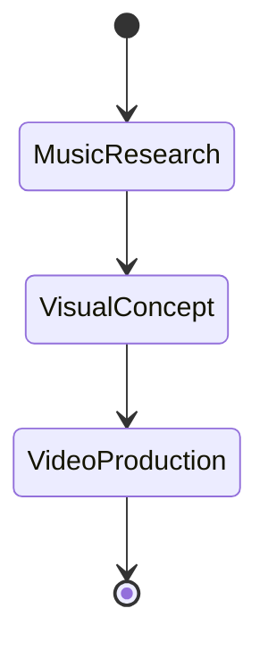
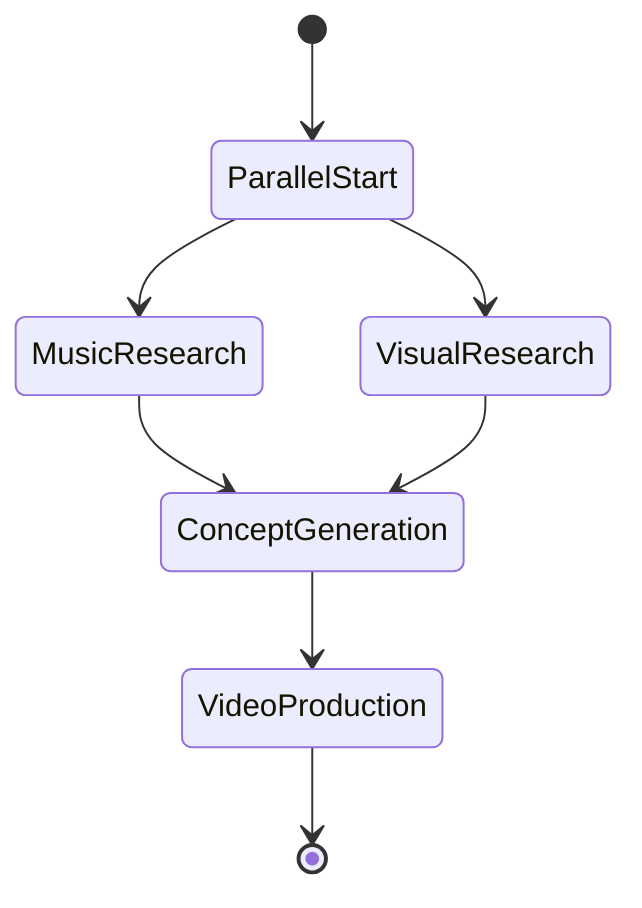
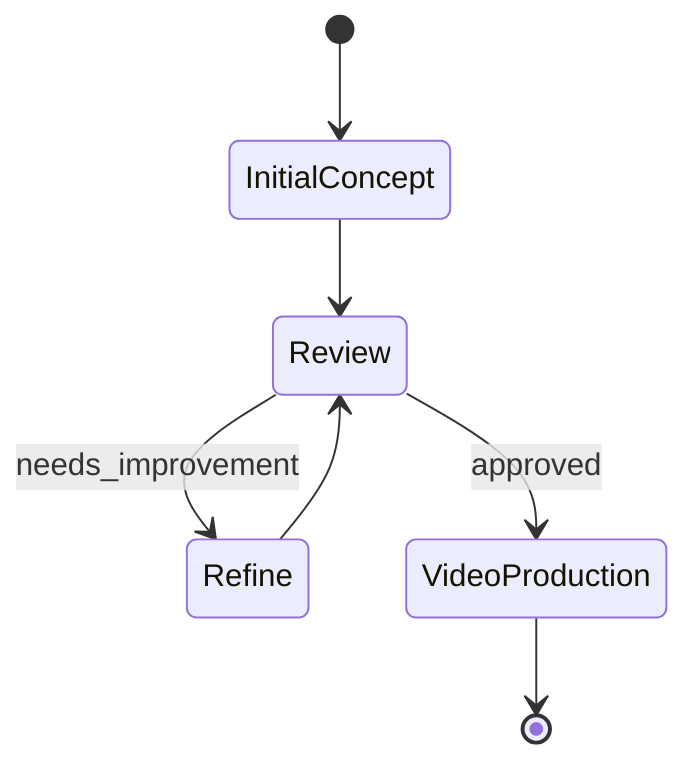

# Agent Coordination Strategy for Empire.AI

*Created: 2025-11-14*

## Overview

Based on comprehensive research of Pydantic AI's multi-agent patterns, this document outlines the coordination strategy for Empire.AI's music video creation workflow.

## Research Findings Summary

### Pydantic AI Multi-Agent Patterns

1. **Agent Delegation Pattern**
   - One agent delegates work to another via tools
   - Agents are stateless and global
   - Pass `ctx.usage` for usage tracking
   - Delegate needs same or subset of dependencies
   - Type-safe communication with structured outputs

2. **Programmatic Agent Hand-off**
   - Application code controls agent sequence
   - Agents can have different dependencies
   - Human-in-the-loop support
   - Message history continuity

3. **Graph-Based Control Flow**
   - Complex workflows using state machines
   - Node-based execution with state persistence
   - Support for parallel execution and synchronization
   - Human-AI collaboration with interruption/resumption

4. **Four Complexity Levels**
   - Single agent workflows
   - Agent delegation
   - Programmatic hand-off
   - Graph-based control flow

## Empire.AI Agent Architecture

### Recommended Approach: **Hybrid Strategy**

Combining **Agent Delegation** and **Programmatic Hand-off** patterns for optimal flexibility and maintainability.

### Agent Specializations

#### 1. **Music Research Agent** (`MusicResearchAgent`)
**Role**: Music intelligence and artist analysis
**MCP Connection**: Music Research Server
**Responsibilities**:
- Artist profile analysis
- Song context research
- Audio feature analysis
- Similar artist discovery
- Musical trend identification

**Core Tools Access**:
- `music_search`
- `music_get_artist_profile`
- `music_analyze_song`
- `music_analyze_audio_features`
- `music_discover_similar_artists`

#### 2. **Visual Concept Agent** (`VisualConceptAgent`)
**Role**: Visual concept development and research
**MCP Connection**: Visual Content Server
**Responsibilities**:
- Concept art generation
- Reference image research
- Artist visual creation
- Style consistency management
- Visual trend analysis

**Core Tools Access**:
- `visual_generate_concept_image`
- `visual_search_reference_images`
- `visual_create_artist_visual`
- `visual_edit_image`
- `visual_compose_multi_images`
- `visual_research_comprehensive`

#### 3. **Video Production Agent** (`VideoProductionAgent`)
**Role**: Video generation and production management
**MCP Connection**: Video Production Server
**Responsibilities**:
- Music video clip generation
- Video sequence management
- Production workflow orchestration
- Quality control and iteration
- Final video assembly

**Core Tools Access**:
- `video_generate_music_video_clip`
- `video_check_generation_status`
- `video_extend_sequence`
- `video_animate_image`
- `video_generate_frame_directed`
- `video_save_generated`
- `video_create_production_workflow`

#### 4. **Project Orchestrator Agent** (`ProjectOrchestratorAgent`)
**Role**: Overall workflow coordination and project management
**MCP Connection**: All servers (via delegation)
**Responsibilities**:
- Workflow orchestration
- Cross-agent communication
- Progress tracking
- Quality assurance
- User interaction management

### Agent Coordination Patterns

#### Pattern 1: **Sequential Workflow** (Most Common)


**Implementation**:
```python
class ProjectOrchestratorAgent:
    def __init__(self):
        self.music_agent = MusicResearchAgent()
        self.visual_agent = VisualConceptAgent()
        self.video_agent = VideoProductionAgent()
    
    async def create_music_video(self, artist_name: str, song_title: str) -> VideoResult:
        # Phase 1: Music Research
        music_data = await self.music_agent.run(
            f"Research {artist_name} and analyze {song_title}",
            usage=self.usage
        )
        
        # Phase 2: Visual Concept (using music context)
        visual_concepts = await self.visual_agent.run(
            f"Create visual concepts for {song_title} by {artist_name}",
            context=music_data,
            usage=self.usage
        )
        
        # Phase 3: Video Production (using all context)
        video_result = await self.video_agent.run(
            f"Produce music video for {song_title}",
            context={"music": music_data, "visual": visual_concepts},
            usage=self.usage
        )
        
        return video_result
```

#### Pattern 2: **Parallel Research** (Optimization)


**Implementation**:
```python
async def parallel_research_workflow(self, artist_name: str, song_title: str):
    # Run music and visual research in parallel
    music_task = self.music_agent.run(f"Research {artist_name} and {song_title}")
    visual_task = self.visual_agent.run(f"Research visual references for {artist_name}")
    
    music_data, visual_references = await asyncio.gather(music_task, visual_task)
    
    # Combine insights for concept generation
    concepts = await self.visual_agent.run(
        f"Generate concepts combining music analysis and visual references",
        context={"music": music_data, "references": visual_references}
    )
    
    return concepts
```

#### Pattern 3: **Iterative Refinement** (Quality Focus)


**Implementation**:
```python
async def iterative_concept_refinement(self, initial_concept: ConceptData):
    current_concept = initial_concept
    max_iterations = 3
    
    for iteration in range(max_iterations):
        # Review current concept
        review = await self.orchestrator_agent.run(
            f"Review concept quality and suggest improvements",
            context=current_concept
        )
        
        if review.approved:
            return current_concept
        
        # Refine based on feedback
        current_concept = await self.visual_agent.run(
            f"Refine concept based on feedback: {review.feedback}",
            context=current_concept
        )
    
    return current_concept  # Return best attempt
```

### Data Models for Agent Communication

#### Shared Context Models
```python
from pydantic import BaseModel, Field
from typing import Optional, List, Dict, Any

class ArtistProfile(BaseModel):
    """Comprehensive artist data from music research."""
    name: str
    genres: List[str]
    audio_features: Dict[str, float]
    biography: Optional[str]
    similar_artists: List[str]
    cultural_context: Optional[str]

class SongAnalysis(BaseModel):
    """Detailed song analysis data."""
    title: str
    artist: str
    lyrics: Optional[str]
    themes: List[str]
    mood: str
    musical_characteristics: Dict[str, Any]
    audio_features: Dict[str, float]

class VisualConcept(BaseModel):
    """Visual concept with generation data."""
    concept_id: str
    description: str
    style: str
    mood: str
    color_palette: Optional[str]
    reference_images: List[str]
    generated_images: List[str]
    confidence_score: float

class VideoSegment(BaseModel):
    """Video segment with metadata."""
    segment_id: str
    concept: VisualConcept
    duration: int
    style: str
    operation_id: Optional[str]
    status: str
    video_path: Optional[str]

class ProjectContext(BaseModel):
    """Complete project context shared between agents."""
    project_id: str
    artist_profile: Optional[ArtistProfile]
    song_analysis: Optional[SongAnalysis]
    visual_concepts: List[VisualConcept]
    video_segments: List[VideoSegment]
    workflow_status: str
    created_at: str
    updated_at: str

class AgentResult(BaseModel):
    """Standardized agent result format."""
    success: bool
    data: Optional[Any]
    error: Optional[str]
    metadata: Dict[str, Any]
    next_steps: Optional[List[str]]

class Failed(BaseModel):
    """Standardized failure response."""
    reason: str
    error_code: Optional[str]
    recovery_suggestions: Optional[List[str]]
```

### Agent Implementation Architecture

#### Base Agent Class
```python
from abc import ABC, abstractmethod
from pydantic_ai import Agent, RunContext, RunUsage
from mcp import ClientSession

class BaseEmpireAgent(ABC):
    """Base class for all Empire.AI agents."""
    
    def __init__(self, mcp_session: ClientSession, model: str = "anthropic:claude-3.5-sonnet"):
        self.mcp_session = mcp_session
        self.model = model
        self.agent = self._init_agent()
        self.usage = RunUsage()
    
    @abstractmethod
    def _init_agent(self) -> Agent:
        """Initialize the Pydantic AI agent with tools and prompts."""
        pass
    
    @abstractmethod
    def get_system_prompt(self) -> str:
        """Get agent-specific system prompt."""
        pass
    
    async def run(self, query: str, context: Optional[ProjectContext] = None) -> AgentResult | Failed:
        """Run agent with standardized input/output."""
        try:
            result = await self.agent.run(
                query,
                deps=context,
                usage=self.usage
            )
            return AgentResult(
                success=True,
                data=result.output,
                metadata={"usage": self.usage.model_dump()}
            )
        except Exception as e:
            return Failed(
                reason=str(e),
                error_code=type(e).__name__
            )
```

#### Specialized Agent Implementation
```python
class MusicResearchAgent(BaseEmpireAgent):
    """Agent specialized in music research and analysis."""
    
    def _init_agent(self) -> Agent:
        agent = Agent(
            model=self.model,
            output_type=ArtistProfile | SongAnalysis | Failed,
            deps_type=ProjectContext,
            system_prompt=self.get_system_prompt()
        )
        
        @agent.tool
        async def research_artist(ctx: RunContext[ProjectContext], artist_name: str) -> str:
            """Research artist using music research MCP server."""
            result = await self.mcp_session.call_tool(
                "music_get_artist_profile",
                {
                    "artist_name": artist_name,
                    "include_audio_analysis": True,
                    "include_biography": True,
                    "include_similar_artists": True
                }
            )
            return str(result)
        
        @agent.tool
        async def analyze_song(ctx: RunContext[ProjectContext], song_title: str, artist_name: str) -> str:
            """Analyze song using music research MCP server."""
            result = await self.mcp_session.call_tool(
                "music_analyze_song",
                {
                    "song_title": song_title,
                    "artist_name": artist_name,
                    "include_lyrics": True,
                    "include_annotations": True,
                    "include_audio_features": True
                }
            )
            return str(result)
        
        return agent
    
    def get_system_prompt(self) -> str:
        return """
        You are a music research specialist for Empire.AI's music video creation system.
        
        Your role is to:
        1. Research artists thoroughly using available tools
        2. Analyze songs for lyrical content, themes, and musical characteristics
        3. Identify musical patterns and audio features
        4. Provide cultural and historical context
        5. Suggest related artists and influences
        
        Always provide comprehensive, structured data that will inform visual and video creation.
        Focus on elements that can inspire visual concepts and video aesthetics.
        """
```

### Coordination Mechanisms

#### 1. **Dependency Injection Pattern**
```python
@dataclass
class EmpireAgentDeps:
    project_context: ProjectContext
    mcp_sessions: Dict[str, ClientSession]  # Multiple MCP servers
    file_manager: FileManager
    progress_tracker: ProgressTracker
```

#### 2. **Message Passing Pattern**
```python
class AgentMessage(BaseModel):
    from_agent: str
    to_agent: str
    message_type: str
    payload: Dict[str, Any]
    timestamp: str

class AgentCommunicationBus:
    """Centralized communication between agents."""
    
    async def send_message(self, message: AgentMessage):
        """Route message to target agent."""
        pass
    
    async def broadcast(self, message: AgentMessage, exclude: Optional[List[str]] = None):
        """Broadcast to all agents except excluded ones."""
        pass
```

#### 3. **State Persistence Pattern**
```python
class ProjectStatePersistence:
    """Persist project state across agent interactions."""
    
    async def save_context(self, project_id: str, context: ProjectContext):
        """Save project context to storage."""
        pass
    
    async def load_context(self, project_id: str) -> ProjectContext:
        """Load project context from storage."""
        pass
    
    async def update_partial(self, project_id: str, updates: Dict[str, Any]):
        """Partial update of project context."""
        pass
```

### Implementation Priority

#### Phase 1: Basic Agent Delegation
1. Implement base agent classes
2. Create specialized agents with MCP tool access
3. Implement simple sequential workflow
4. Basic error handling and logging

#### Phase 2: Enhanced Coordination
1. Add parallel execution capabilities
2. Implement iterative refinement workflows
3. Add project state persistence
4. Enhanced error recovery

#### Phase 3: Advanced Features
1. Graph-based workflow support
2. Human-in-the-loop integration
3. Real-time collaboration
4. Advanced quality control

### Key Design Principles

1. **Type Safety**: All agent communication uses Pydantic models
2. **Modularity**: Agents can be developed and tested independently
3. **Scalability**: Support for parallel execution and load balancing
4. **Resilience**: Comprehensive error handling and recovery
5. **Observability**: Detailed logging and progress tracking
6. **Flexibility**: Support for multiple workflow patterns

This strategy provides a robust foundation for building sophisticated multi-agent music video creation workflows while maintaining code quality and system reliability.
