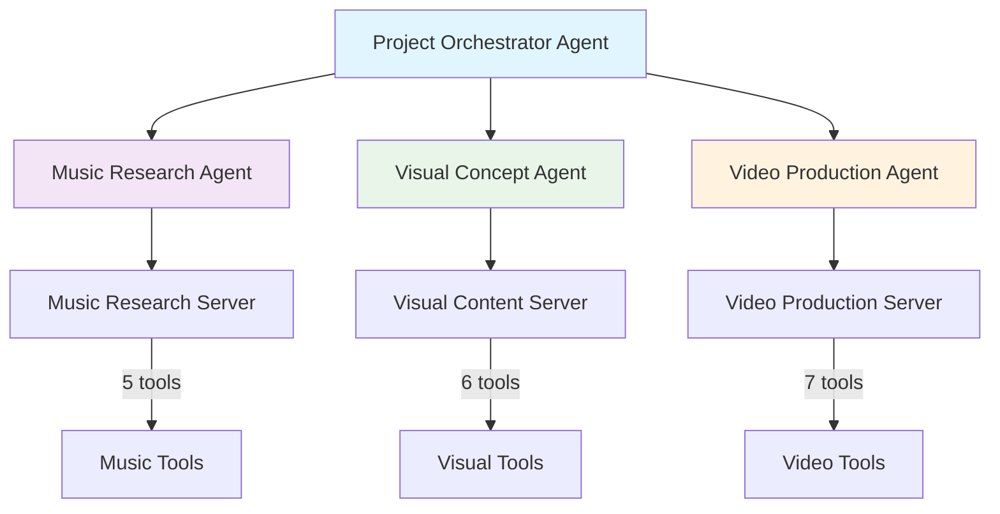
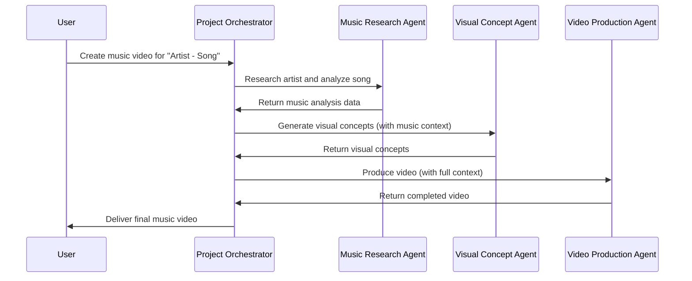
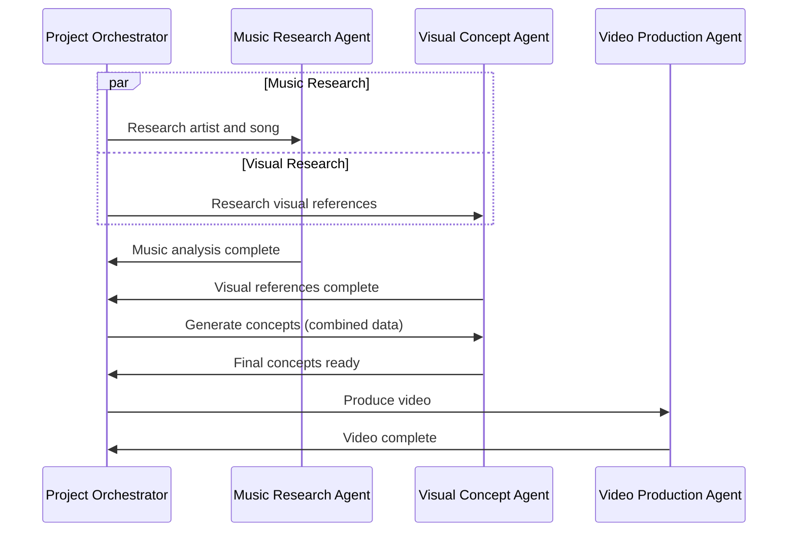
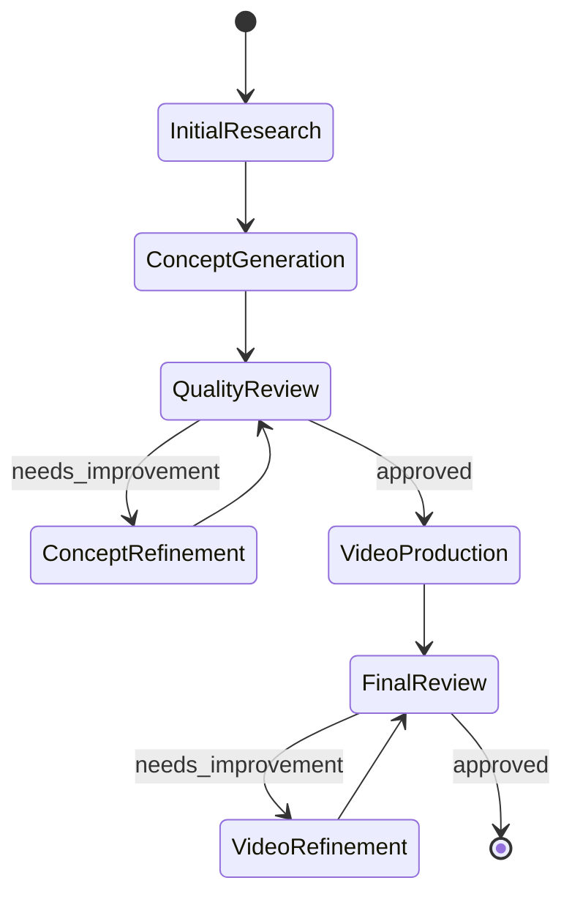
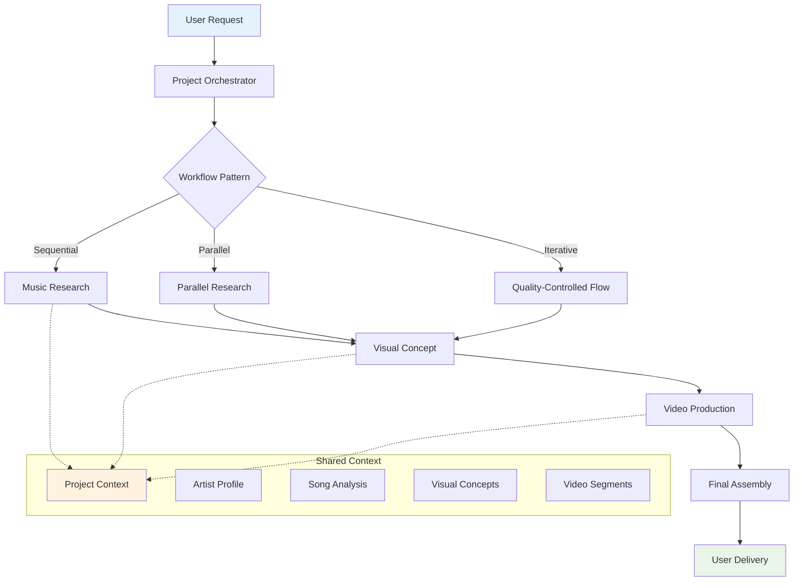

# Multi-Agent Coordination Research for Empire.AI

*Research Date: 2025-11-14*  
*Status: Complete*

## Executive Summary

This document presents comprehensive research findings on Pydantic AI's multi-agent coordination patterns and provides specific recommendations for implementing Empire.AI's music video creation workflow. The research identifies four primary coordination patterns and recommends a hybrid approach combining Agent Delegation and Programmatic Hand-off patterns for optimal flexibility and maintainability.

## Research Methodology

### Sources Analyzed
1. **Pydantic AI Official Documentation**
   - Multi-Agent Patterns: https://ai.pydantic.dev/multi-agent-applications/
   - Graph Workflows: https://ai.pydantic.dev/graph/
   - Agent Architecture: https://ai.pydantic.dev/agents/

2. **Community Resources**
   - DEV Community: Advanced Multi-Agent Systems tutorial
   - Medium: Production AI agent implementations
   - Reddit: Real-world usage discussions

3. **Technical Analysis**
   - Code pattern analysis
   - Performance considerations
   - Type safety evaluation
   - Error handling capabilities

## Key Research Findings

### Pydantic AI Multi-Agent Coordination Patterns

#### 1. Agent Delegation Pattern
**Concept**: One agent delegates specific subtasks to other agents via tools, maintaining control flow.

**Characteristics**:
- Agents are stateless and designed to be global
- Type-safe communication using Pydantic models
- Shared usage tracking via `ctx.usage`
- Delegate agents need same or subset of dependencies
- Clean separation of concerns

**Use Cases**:
- Specialized task distribution
- Modular responsibility assignment
- Cross-domain expertise integration

**Example Implementation**:
```python
@parent_agent.tool
async def specialized_task(ctx: RunContext[DepsType], params: str) -> str:
    result = await specialist_agent.run(
        f"Perform specialized task: {params}",
        usage=ctx.usage  # Shared usage tracking
    )
    return result.output
```

#### 2. Programmatic Agent Hand-off
**Concept**: Application code explicitly controls agent sequence and data flow.

**Characteristics**:
- Explicit control transfer during runtime
- Agents can have different dependency types
- Support for human-in-the-loop workflows
- Message history continuity across agents
- Complex workflow orchestration

**Use Cases**:
- Multi-stage workflows
- Quality control checkpoints
- User interaction integration
- Complex decision trees

**Example Implementation**:
```python
async def workflow_orchestration(user_input: str):
    # Stage 1: Analysis
    analysis = await analysis_agent.run(user_input)
    
    # Stage 2: Generation (with context)
    generation = await generation_agent.run(
        "Generate based on analysis",
        deps=GenerationDeps(analysis_data=analysis.output)
    )
    
    # Stage 3: Review (optional human input)
    if requires_review(generation):
        review = await get_human_feedback(generation)
        final_result = await refinement_agent.run(
            "Refine based on feedback",
            deps=RefinementDeps(original=generation, feedback=review)
        )
    else:
        final_result = generation
    
    return final_result
```

#### 3. Graph-Based Control Flow
**Concept**: Complex workflows using state machines with nodes representing execution states.

**Characteristics**:
- Finite state machine architecture
- State persistence and interruption/resumption
- Support for parallel execution paths
- Conditional branching based on context
- Visual workflow representation

**Use Cases**:
- Complex multi-path workflows
- Long-running processes
- Collaborative human-AI workflows
- Production pipeline management

**Example Node Structure**:
```python
@dataclass
class AnalysisNode(BaseNode[ProjectState, Dependencies, AnalysisResult]):
    input_data: str
    
    async def run(self, ctx: GraphRunContext) -> ConceptNode | End[AnalysisResult]:
        analysis = await perform_analysis(self.input_data)
        if analysis.confidence > 0.8:
            return ConceptNode(analysis_data=analysis)
        else:
            return End(AnalysisResult(status="insufficient_data"))
```

#### 4. Direct Model Communication
**Concept**: Simple single-agent workflows with direct model interaction.

**Characteristics**:
- Minimal coordination overhead
- Direct LLM communication
- Simple request-response patterns
- Limited cross-agent integration

**Use Cases**:
- Simple tasks
- Prototyping
- Single-domain operations
- Testing and validation

### Complexity Levels Analysis

Pydantic AI supports four levels of application complexity:

1. **Level 1: Single Agent** - Direct model interaction
2. **Level 2: Agent Delegation** - One agent delegates to others
3. **Level 3: Programmatic Hand-off** - Application controls agent sequence
4. **Level 4: Graph-Based Flow** - State machine workflow control

## Recommended Architecture for Empire.AI

### Strategy: Hybrid Approach

**Primary Pattern**: Agent Delegation (Level 2)  
**Secondary Pattern**: Programmatic Hand-off (Level 3)  
**Future Extension**: Graph-Based Flow (Level 4)

### Rationale

1. **Agent Delegation** provides clean separation between music research, visual concept development, and video production
2. **Programmatic Hand-off** enables complex workflow orchestration and quality control
3. **Hybrid approach** offers flexibility to choose optimal pattern per workflow stage
4. **Type safety** ensures reliable communication between specialized agents
5. **Scalability** supports both simple and complex video creation scenarios

### Agent Specialization Strategy

#### Agent Roles and Responsibilities



#### Coordination Flow Patterns

##### Pattern 1: Sequential Workflow (Standard)


##### Pattern 2: Parallel Research (Optimized)


##### Pattern 3: Iterative Refinement (Quality-Focused)


### Data Flow Architecture



### Communication Patterns

#### Type-Safe Message Structure
```mermaid
classDiagram
    class ProjectContext {
        +project_id: str
        +artist_profile: ArtistProfile
        +song_analysis: SongAnalysis
        +visual_concepts: List[VisualConcept]
        +video_segments: List[VideoSegment]
        +workflow_status: str
    }
    
    class AgentResult {
        +success: bool
        +data: Any
        +error: str
        +metadata: Dict
        +next_steps: List[str]
    }
    
    class Failed {
        +reason: str
        +error_code: str
        +recovery_suggestions: List[str]
    }
    
    ProjectContext ||--o{ ArtistProfile
    ProjectContext ||--o{ SongAnalysis
    ProjectContext ||--o{ VisualConcept
    ProjectContext ||--o{ VideoSegment
    
    AgentResult ||--|| Failed : "Union Type"
```

## Technical Implementation Considerations

### Dependency Management

1. **Shared Dependencies**
   - MCP client sessions for each server
   - File management system
   - Progress tracking utilities
   - Configuration management

2. **Agent-Specific Dependencies**
   - Music Research: Spotify, Last.fm, Genius clients
   - Visual Content: Gemini, Google Search clients
   - Video Production: Veo client, file storage

3. **Dependency Injection Pattern**
```python
@dataclass
class EmpireAgentDeps:
    project_context: ProjectContext
    mcp_sessions: Dict[str, ClientSession]
    file_manager: FileManager
    progress_tracker: ProgressTracker
    config: AppConfig
```

### Error Handling Strategy

1. **Graceful Degradation**
   - Fallback to alternative agents
   - Partial result delivery
   - User notification of limitations

2. **Retry Mechanisms**
   - Exponential backoff for API calls
   - Agent-level retry logic
   - Cross-agent error recovery

3. **State Recovery**
   - Persistent project state
   - Workflow checkpoint saving
   - Resume from failure points

### Performance Optimization

1. **Parallel Execution**
   - Concurrent research phases
   - Async agent communication
   - Background processing

2. **Caching Strategies**
   - Artist profile caching
   - Visual concept reuse
   - Generated content storage

3. **Resource Management**
   - Connection pooling
   - Memory optimization
   - File cleanup automation

## Advantages of Recommended Approach

### Technical Benefits

1. **Type Safety**
   - Compile-time validation
   - Runtime error prevention
   - Clear interface contracts

2. **Modularity**
   - Independent agent development
   - Isolated testing capabilities
   - Flexible deployment options

3. **Scalability**
   - Horizontal agent scaling
   - Load balancing support
   - Resource optimization

4. **Maintainability**
   - Clear separation of concerns
   - Standardized communication patterns
   - Comprehensive logging

### Business Benefits

1. **Flexibility**
   - Multiple workflow patterns
   - Customizable quality levels
   - Adaptive processing

2. **Reliability**
   - Robust error handling
   - Graceful degradation
   - Recovery mechanisms

3. **Observability**
   - Detailed progress tracking
   - Performance monitoring
   - Quality metrics

4. **Extensibility**
   - Easy addition of new agents
   - Workflow pattern expansion
   - Integration capabilities

## Risk Analysis

### Technical Risks

1. **Complexity Management**
   - **Risk**: Over-engineering coordination logic
   - **Mitigation**: Start simple, iterate based on needs

2. **Performance Overhead**
   - **Risk**: Agent coordination latency
   - **Mitigation**: Optimize critical paths, use caching

3. **State Synchronization**
   - **Risk**: Inconsistent project state across agents
   - **Mitigation**: Centralized state management, atomic updates

### Operational Risks

1. **Agent Failure Cascades**
   - **Risk**: One agent failure affecting entire workflow
   - **Mitigation**: Circuit breaker patterns, fallback agents

2. **Resource Exhaustion**
   - **Risk**: Parallel agents consuming excessive resources
   - **Mitigation**: Resource limits, queue management

3. **Quality Control**
   - **Risk**: Inconsistent output quality across agents
   - **Mitigation**: Standardized quality metrics, validation layers

## Success Metrics

### Technical Metrics

1. **Performance**
   - Agent response time < 30 seconds
   - Workflow completion time < 5 minutes
   - Error rate < 5%

2. **Quality**
   - Type safety coverage 100%
   - Test coverage > 90%
   - Code maintainability index > 80

3. **Reliability**
   - System uptime > 99%
   - Successful workflow completion > 95%
   - Recovery time < 2 minutes

### Business Metrics

1. **User Experience**
   - User satisfaction score > 4.5/5
   - Task completion rate > 90%
   - Support ticket reduction

2. **Operational Efficiency**
   - Development velocity increase
   - Maintenance cost reduction
   - Feature delivery acceleration

## Conclusion

The hybrid approach combining Agent Delegation and Programmatic Hand-off patterns provides the optimal balance of flexibility, maintainability, and performance for Empire.AI's music video creation workflow. This research-backed strategy enables sophisticated multi-agent coordination while maintaining code quality and system reliability.

The modular agent architecture supports both current requirements and future extensibility, positioning Empire.AI for scalable growth and feature enhancement.

---

**Next Steps**: Proceed to implementation planning phase with detailed technical specifications and development roadmap.
